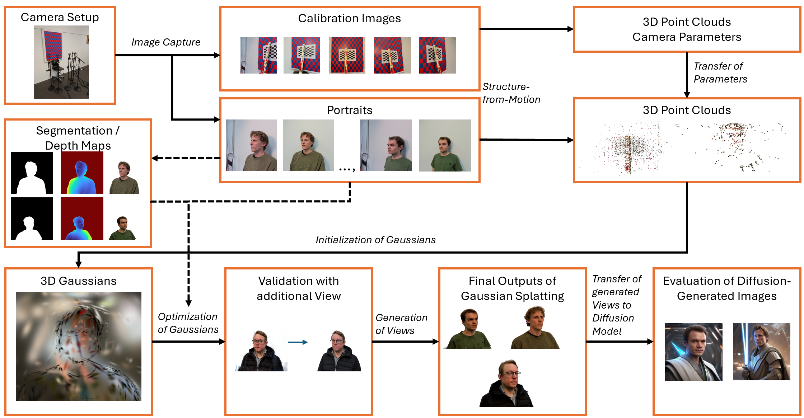

# Sparse Input Gaussian Splatting for 3D Facial Reconstruction and Augmentation of Stable Diffusion based Person Generation




**Authors**
Can-Elian Barth (canelian.barth@students.fhnw.ch)
Jan Zumwald (jan.zumwald@students.fhnw.ch)

**Affiliation**
FHNW University of Applied Sciences and Arts Northwestern Switzerland

**Supervisors**
Michael Graber, Moritz Kirschmann

## Project Overview

**Purpose:**
The Enter Technikwelt museum in Solothurn (https://enter.ch/en/visit-the-exhibition/) installed an AI selfie booth that captures five photos per visitor for a Stable Diffusion person generation with prompts. 
But this limited input diversity can harm output quality. To address this, we reconstruct each subject in 3D using Gaussian Splatting, synthesize additional viewpoints, and use these new images to augment a Stable Diffusion model trying to enhance face quality and recognizability for the users.

**Methods:**
To achieve high-quality 3D reconstructions of each face, we apply a Gaussian Splatting pipeline. We then synthesize intermediate viewpoints from the fitted Gaussians to get a richer set of inputs for the Stable Diffusion portrait model.
We experiment with different numbers of generated views as additional inputs, and present the resulting images to users, who rate how well they recognize themselves between 1 (bad) and 5 (good). These ratings provide a direct measure of whether our view-based augmentation strategy successfully improves recognizability.

**Results:**
In our user study, participants mostly rated the large augmented model (21 views) highest—achieving a mean score of 3.43 versus 2.75 for the basic model and 2.82 for the small augmentation.
On the reconstruction side, depth regularization and background masking yielded noticeably cleaner intermediate views, but differences in validation and visual quality remained across subjects.

**Conclusion:**
We could confirm that additional Gaussian Splatting views improve recognizability. However, we could not conclusively demonstrate that the improvements stem from the newly rendered views themselves rather than simply from having more images in the Stable Diffusion fine-tuning.
But overall, we view Gaussian Splatting as a valuable augmentation in this specific setting. To further enhance reconstruction quality, we recommend adding additional cameras and capturing all views simultaneously.


## Getting started
Some of the Files are from the Github (https://github.com/graphdeco-inria/gaussian-splatting) from the Original Gaussian Splatting Paper (https://repo-sam.inria.fr/fungraph/3d-gaussian-splatting/)
- Install ColMap https://github.com/colmap/colmap/releases

Optional if you want to resize Images:
- Install https://imagemagick.org/script/download.php
- install https://ffmpeg.org/download.html

This Video shows how to install the dependencies for the Original Gaussian Splatting Repo: https://www.youtube.com/watch?v=UXtuigy_wYc
Its the same for this repo.

- Make an Virtual Environment
- Install PyTorch Cuda with your GPU version (e.g. 11.8, 12.4, 12.6) https://pytorch.org/get-started/locally/
- Install the requirements with requirements.bat / requirements.sh (just run the file)

Most Important Files and Directory Description:
- Sapiens-Pytorch-Inference: Contains Files for running the Models from Meta's Sapiens Human Vision Foundation Collection. (https://arxiv.org/abs/2408.12569)
We used the Segmentation and Depth Map Models. To generate a segmentation mask and a depth map for each image run: 
```python utils/make_depth_maps   input_imgs/ out_depth/ out_seg/``` this generates the depth maps and segmentation masks at the two out paths.
If you run it the first time, it will download the models from Huggingface.

- arguments: contains the arguments file for training Gaussian Splatting

- data: contains the data for the Gaussian Splatting (Here only Chessboard Calibration Data but normally Face Pictures of our Test subjects and us with the generated depth maps and segmentation masks)

- notebooks: contains the notebooks for analyis and the User Study.

- outputs: would contain outsputs of the models, but we did not push it because its to much and to big for all the runs.

- scene: contains the scene utils for Gaussian Splatting like loading scenes and camera positions.

- utils: contains the utils for Gaussian Splatting like rendering, creating intermediate views, making depth maps...

- main_gs.ipynb: the main notebook for running Gaussian Splatting, it contains all the steps from loading the data, to training the model and rendering the intermediate views.

- train.py : the main training script for Gaussian Splatting which we use in the main notebook
